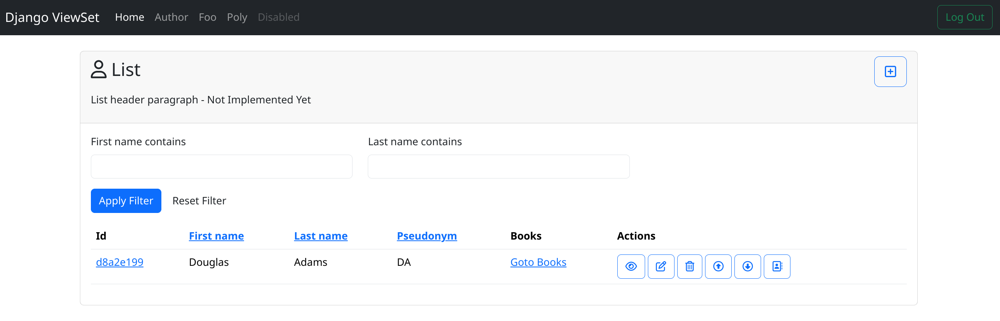

# Run Example

To run the Bootstrap5 example...

Clone the repository:

```bash
git clone TODO
cd django-viewset
```

Create a virtual environment:

```bash
python -m venv .venv
```

Then Install Django-ViewSet

```bash
pip install -e .
```

> **Note:** this installs `django-viewsets` in development mode. 

Init the project:
```bash
cd example/bootstrap5
./manage.py migrate
./manage.py createsuperuser --noinput
```

Finally open the browser:

[http://localhost:8000](http://localhost:8000)

You need to login with the superuser you created before.

They you should see the following screen:


