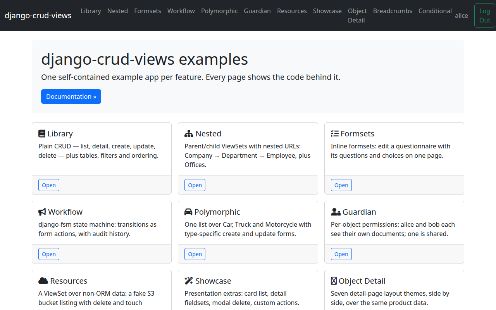

# Part 1 — Setup & first ViewSet

This tutorial builds the `library/` app of the bundled example project step by
step. By the end of Part 6 you'll have a working `Author`/`Book` library with
list, detail, create, update, and delete views, filtering, and reordering —
the same app that ships at
[`examples/bootstrap5/library/`](https://github.com/jacob-consulting/django-crud-views/tree/main/examples/bootstrap5/library)
on GitHub. You can check out the repository and follow along in the real
files, or just read along here.

> **Prerequisites:** this tutorial assumes basic Django knowledge — a project
> with at least one app already created. If you need a refresher, see the
> [Django tutorial](https://docs.djangoproject.com/en/stable/intro/tutorial01/).

## Install

```bash
pip install django-crud-views
```

This pulls in the core dependencies you'll need for the whole tutorial:
django-tables2 (list tables), django-filter (list filtering),
django-crispy-forms and crispy-bootstrap5 (form rendering), and
django-bootstrap5 (Bootstrap 5 widgets and pagination). Part 6 adds one more
feature — reordering rows — which needs an extra: `pip install
django-crud-views[ordered]`. We'll call that out again when we get there.

## Settings

Add these apps to `INSTALLED_APPS`:

```python
INSTALLED_APPS = [
    ...
    "django.contrib.humanize",
    "django_bootstrap5",
    "crispy_forms",
    "crispy_bootstrap5",
    "django_tables2",
    "crud_views.apps.CrudViewsConfig",
    "library",
]
```

`library` is the app we're building in this tutorial; the rest are the
frontend and rendering libraries `django-crud-views` builds on.

Then add the crispy-forms and crud_views settings:

```python
# crispy forms
CRISPY_TEMPLATE_PACK = "bootstrap5"
CRISPY_ALLOWED_TEMPLATE_PACKS = "bootstrap5"

# django-crud-views
CRUD_VIEWS_EXTENDS = "project/crud_views.html"
```

`CRUD_VIEWS_EXTENDS` points at *your* base template — every crud_views
template ``s it, so this is how your CRUD pages pick up your
site's navigation, styling, and layout. See
[Base template](../reference/templates.md) for the full resolution order
(you can also override it per-ViewSet or per-view). The bundled example's
base template lives at
[`examples/bootstrap5/project/templates/project/crud_views.html`](https://github.com/jacob-consulting/django-crud-views/tree/main/examples/bootstrap5/project/templates/project/crud_views.html)
if you want to see a working one.

## The model

Here's the `Author` model we'll build the rest of the tutorial around:

<!-- cv-sync: library/models.py -->
```python
class Author(models.Model):
    id = models.UUIDField(primary_key=True, default=uuid.uuid4, editable=False)
    first_name = models.CharField(max_length=100)
    last_name = models.CharField(max_length=100)
    pseudonym = models.CharField(max_length=100, blank=True, null=True)
    created_dt = models.DateTimeField(auto_now_add=True, verbose_name="Created")
    modified_dt = models.DateTimeField(auto_now=True, verbose_name="Modified")

    class Meta:
        ordering = ["last_name", "first_name"]

    def __str__(self):
        return f"{self.first_name} {self.last_name}"
```

A plain Django model — nothing crud_views-specific here. It uses a `UUIDField`
primary key, which `django-crud-views` will auto-detect in a moment and use
to generate UUID-typed URL patterns.

Create and apply the migration:

```bash
python manage.py makemigrations library
python manage.py migrate
```

## The ViewSet

A `ViewSet` is the registry and URL router for one model's family of views —
list, detail, create, update, delete. Every view that belongs to `Author`
registers itself with the same `ViewSet` instance, and that's how sibling
views know how to link to each other (a list row's "detail" button, a
detail page's "edit" link, and so on).

<!-- cv-sync: library/views.py -->
```python
cv_author = ViewSet(model=Author, name="author", icon_header="fa-regular fa-user")
```

That's the whole ViewSet declaration. `ViewSet` auto-detects the primary
key's type from the model — `UUIDField` here, so it generates URL patterns
that match a UUID rather than an integer or slug. `name` is the URL
namespace/prefix for this ViewSet's views, and `icon_header` is a Font
Awesome icon class shown next to the page heading.

It's declared alongside a small unmarked import block:

```python
from crud_views.lib.views import ListViewPermissionRequired, ListViewTableMixin
from crud_views.lib.viewset import ViewSet

from library.models import Author
```

## First view + urls

For now, let's get the simplest possible list view working — just a table,
no filtering yet (that's Part 5):

```python
class AuthorListView(ListViewTableMixin, ListViewPermissionRequired):
    cv_viewset = cv_author
    table_class = AuthorTable  # defined in Part 2
```

`cv_viewset` links the view back to the `ViewSet` it belongs to; every
`CrudView` subclass needs this. `table_class` isn't defined yet — we'll build
`AuthorTable` in Part 2.

Wire the ViewSet's URL patterns into your app's `urls.py`:

```python
urlpatterns = cv_author.urlpatterns
```

(The real `library/urls.py` also wires up a second ViewSet, for `Book`, that
we introduce later — so this reduced form is for `library` alone. Part 6
shows the file's final, verbatim form.)

## What you'll get

The bundled example project's home page lists every ViewSet-backed app,
including the finished `library` app:



Next: [Part 2 — The list view](tutorial-2-list.md)
