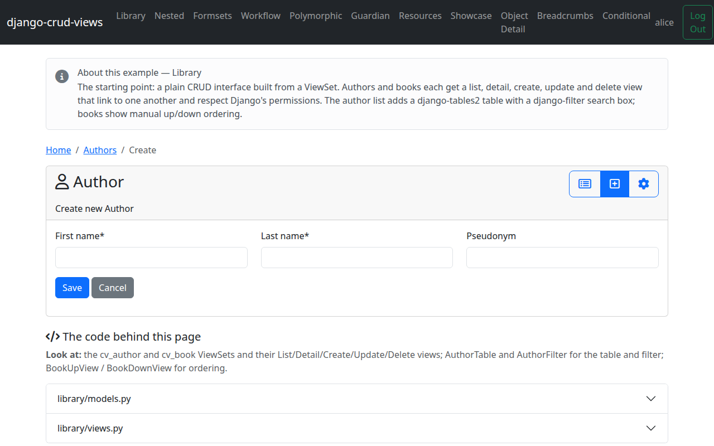
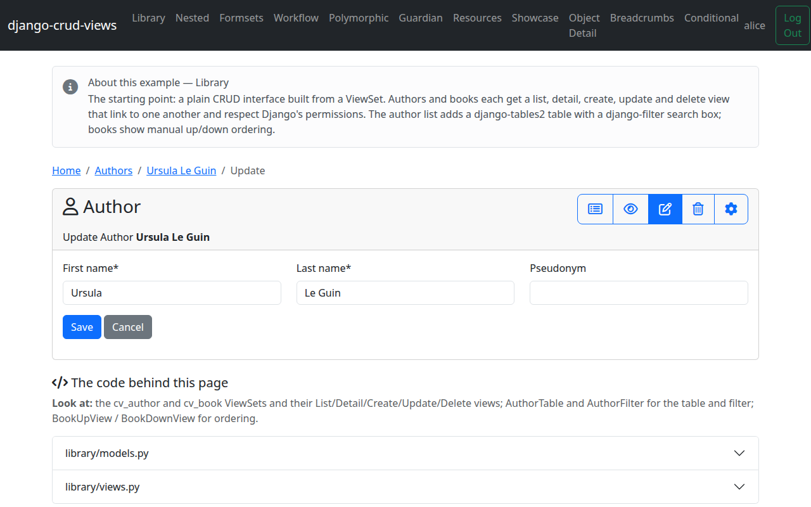
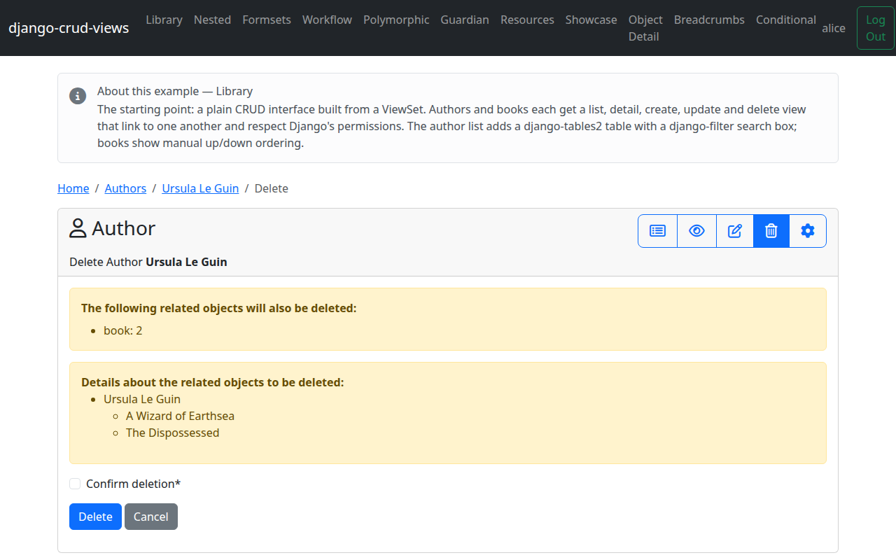

# Part 3 — Create, update, delete

With list and detail groundwork in place, let's add the write side: a shared
crispy form, and the create, update, and delete views that use it.

## The form

`CrispyModelForm` renders a `ModelForm` with django-crispy-forms, using a
layout you control via `get_layout_fields`. Here's `AuthorForm`:

<!-- cv-sync: library/views.py -->
```python
class AuthorForm(CrispyModelForm):
    submit_label = "Save"

    class Meta:
        model = Author
        fields = ["first_name", "last_name", "pseudonym"]

    def get_layout_fields(self):
        return Row(Column4("first_name"), Column4("last_name"), Column4("pseudonym"))
```

`submit_label` overrides the submit button's text. `get_layout_fields` returns
a crispy `Layout` (or, as here, a single `Row`) built from `Column2` /
`Column4` / `Column6` — these aren't crud_views-specific widgets, just thin
`Column` subclasses that set a Bootstrap grid CSS class (`col-md-2`,
`col-md-4`, `col-md-6`), so three `Column4`s side by side fill the row.

## Create/Update views

Both views reuse `AuthorForm`. `AuthorCreateView`:

<!-- cv-sync: library/views.py -->
```python
class AuthorCreateView(BreadcrumbMixin, CrispyViewMixin, MessageMixin, CreateViewPermissionRequired):
    cv_viewset = cv_author
    form_class = AuthorForm
    cv_message_template_code = "Created author »{{ object }}«"
```

And `AuthorUpdateView`:

<!-- cv-sync: library/views.py -->
```python
class AuthorUpdateView(BreadcrumbMixin, CrispyViewMixin, MessageMixin, UpdateViewPermissionRequired):
    cv_viewset = cv_author
    form_class = AuthorForm
    cv_message_template_code = "Updated author »{{ object }}«"
```

Both inherit `BreadcrumbMixin` — that's the example project's breadcrumb
adoption point, covered in Part 6; ignore it until then. `CrispyViewMixin`
doesn't render the form itself — it passes the view into the form's kwargs so
`CrispyModelForm` can build its crispy helper and layout, and the actual
rendering happens through that helper in the templates. `MessageMixin` adds a
`messages.success` call on successful submit: `cv_message_template_code` is
an inline Django template string rendered with the object in context (hence
`{{ object }}`, not `{object}`) — `str(self.object)` is what ends up in the
message, so it reads "Created author »Ursula Le Guin«". Its sibling
`cv_message_template` does the same job but points at a template snippet
file instead of an inline string.





## Delete view

Delete gets its own form class rather than `AuthorForm`:

<!-- cv-sync: library/views.py -->
```python
class AuthorDeleteView(BreadcrumbMixin, CrispyViewMixin, MessageMixin, DeleteViewPermissionRequired):
    cv_viewset = cv_author
    form_class = CrispyDeleteForm
    cv_message_template_code = "Deleted author »{{ object }}«"
    cv_show_related_objects = True
```

`CrispyDeleteForm` is a confirmation form: a checkbox the user must tick
before the delete goes through, rendered with the same crispy styling as the
other forms. `cv_show_related_objects = True` additionally lists the objects
that will cascade-delete along with this author — useful here since deleting
an author can take their books with it, and you want the user to see that
before confirming.



Next: [Part 4 — The detail view](tutorial-4-detail.md)
