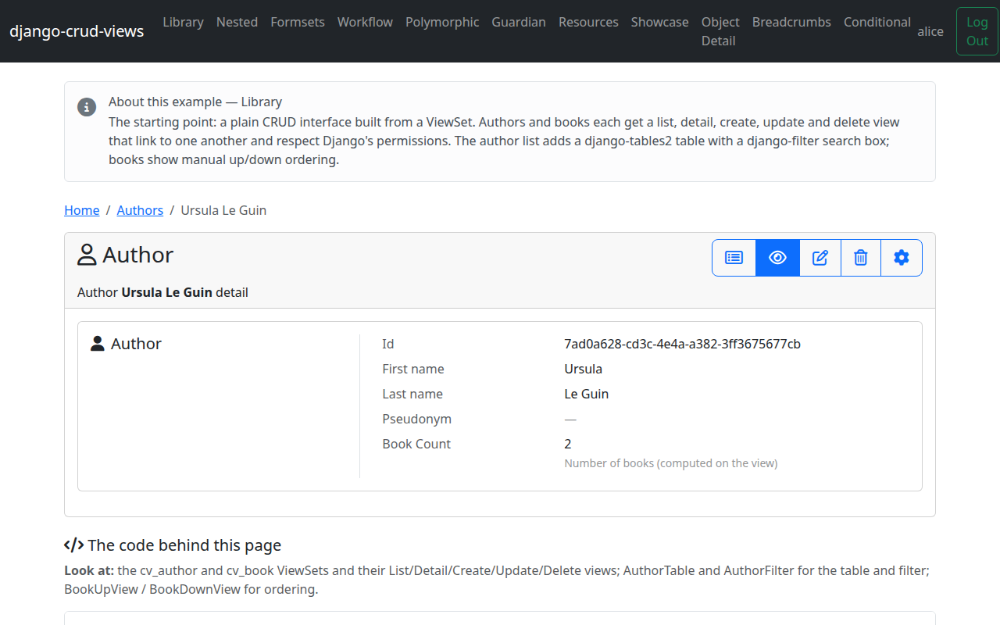

# Part 4 — The detail view

The list view links to a detail page for each author. Rather than writing a
custom template, we'll use `crud_views_object_detail` — the modern,
configuration-driven object-detail app that ships in the same distribution.

## Install

Add it to `INSTALLED_APPS`:

```python
INSTALLED_APPS = [
    ...
    "crud_views_object_detail",
]
```

No extra `pip install` needed — it's part of `django-crud-views`. No
migrations are required either.

## The view

`ObjectDetailViewPermissionRequired` renders `cv_property_display` — a list of
property groups — instead of a hand-written template:

<!-- cv-sync: library/views.py -->
```python
class AuthorDetailView(BreadcrumbMixin, ObjectDetailViewPermissionRequired):
    cv_viewset = cv_author
    cv_property_display = [
        {
            "title": "Author",
            "icon": "user",
            "properties": [
                "id",
                "first_name",
                "last_name",
                "pseudonym",
                {"path": "book_count", "detail": "Number of books (computed on the view)"},
            ],
        },
    ]

    def book_count(self, instance):
        # view-callable fallback: called when the path is not found on the model
        return instance.book_set.count()
```

Each group in `cv_property_display` renders as a card, with `title` and
`icon` in the card header and `properties` as its rows. Most entries here are
plain field names, resolved straight off the model instance. `book_count` is
different: there's no `book_count` field or property on `Author`, so
crud_views falls back to looking for a same-named method on the view —
`book_count(self, instance)` — and calls it to get the value. That's how you
mix computed, view-level data into an otherwise model-driven display.

This just scratches the surface of what `cv_property_display` can do — see
[ObjectDetailView](../reference/object_detail_view.md) for the full property
DSL (links, badges, custom templates, field-type overrides) and
[Configuration](../reference/object_detail_configuration.md) for path
traversal and fallback rules in detail.



Next: Part 5 — Filters & permissions
