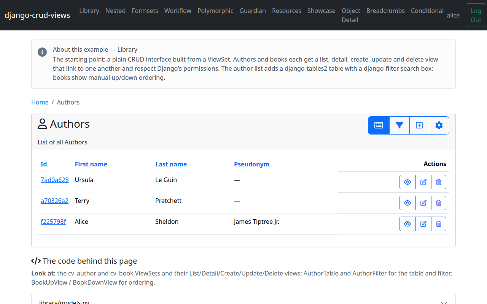

# Part 5 — Filters & permissions

With list, forms, and detail in place, let's finish the list view: add search
filters above the table, then look at how crud_views enforces permissions
throughout the views we've already built.

## The filter

`AuthorFilter` is a plain django-filter `FilterSet` — nothing crud_views-specific:

<!-- cv-sync: library/views.py -->
```python
class AuthorFilter(django_filters.FilterSet):
    first_name = django_filters.CharFilter(lookup_expr="icontains")
    last_name = django_filters.CharFilter(lookup_expr="icontains")

    class Meta:
        model = Author
        fields = ["first_name", "last_name"]
```

Both fields do a case-insensitive substring match. `AuthorFilterFormHelper`
lays the filter form out with crispy, the same way `AuthorForm` does for the
create/update form:

<!-- cv-sync: library/views.py -->
```python
class AuthorFilterFormHelper(ListViewFilterFormHelper):
    layout = Layout(Row(Column4("first_name"), Column4("last_name")))
```

`ListViewFilterFormHelper` is a crispy `FormHelper` subclass tuned for filter
forms (no submit button of its own — the list view renders one). Set
`layout` the same way you would on a `CrispyModelForm`.

## The final list view

Wiring the filter and its helper into `AuthorListView` gives us the final
version of the view we started in [Part 2](tutorial-2-list.md):

<!-- cv-sync: library/views.py -->
```python
class AuthorListView(BreadcrumbMixin, ListViewTableMixin, ListViewTableFilterMixin, ListViewPermissionRequired):
    cv_viewset = cv_author
    table_class = AuthorTable
    filterset_class = AuthorFilter
    formhelper_class = AuthorFilterFormHelper
```

`ListViewTableFilterMixin` renders `filterset_class` as a form above the
table and applies it to the queryset; `formhelper_class` is the crispy
helper that lays that form out. `BreadcrumbMixin` is still the forward
reference from Part 3 — it's covered in Part 6.

## Permissions in practice

Every crud_views view we've written uses a `*PermissionRequired` variant —
`ListViewPermissionRequired`, `CreateViewPermissionRequired`,
`UpdateViewPermissionRequired`, `DeleteViewPermissionRequired` — and each one
maps to a single Django permission: list/detail → `view`, create → `add`,
update → `change`, delete → `delete`.

```python
ListViewPermissionRequired      # requires "view" permission
CreateViewPermissionRequired    # requires "add" permission
UpdateViewPermissionRequired    # requires "change" permission
DeleteViewPermissionRequired    # requires "delete" permission
```

This isn't just a server-side gate. A user without `library.add_author`
never sees the "create" button on the list view or the context buttons — the
button is hidden, not just disabled, because crud_views checks the
permission before rendering it. If that user navigates straight to the
create URL anyway, Django's `PermissionRequiredMixin` returns a 403.

The bundled example grants permissions during seeding, in `library/seed.py`:

<!-- cv-sync: library/seed.py -->
```python
def seed():
    User = get_user_model()
    for username in ("alice", "bob"):
        user = User.objects.get(username=username)
        grant_model_perms(user, Author)
        grant_model_perms(user, Book)
    for first, last, pseudonym, books in AUTHORS:
        author, _ = Author.objects.get_or_create(first_name=first, last_name=last, defaults={"pseudonym": pseudonym})
        for title, price in books:
            Book.objects.get_or_create(title=title, author=author, defaults={"price": Decimal(price)})
```

`grant_model_perms` is a small project-level helper (`project/seeding.py`)
that assigns all four Django model permissions — `view`, `add`, `change`,
`delete` — for a model to a user. Both demo users, `alice` and `bob`, get
full `Author` and `Book` permissions this way; try revoking one via the
Django admin to see the create button and the 403 for yourself.



Next: [Part 6 — A second model: ordering & breadcrumbs](tutorial-6-books.md)
