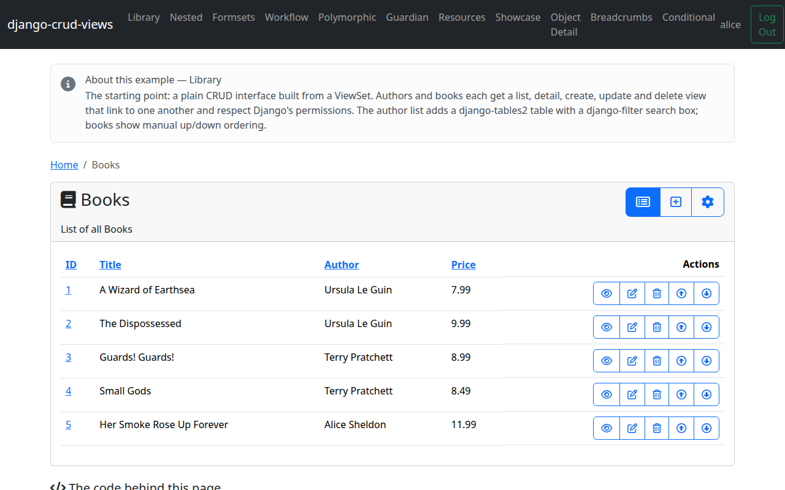

# Part 6 — A second model: ordering & breadcrumbs

Everything so far has been one model. This part adds `Book` — a second
`ViewSet`, nested under nothing but linked to `Author` via a plain foreign
key — and shows off two features that only make sense once there's more than
one view family in play: reorderable rows, and the breadcrumb trail that's
been quietly following us since Part 3.

## The model

Reordering needs the `ordered` extra:

```bash
pip install django-crud-views[ordered]
```

`Book` extends `OrderedModel` from django-ordered-model, and has a plain FK
to `Author`:

<!-- cv-sync: library/models.py -->
```python
class Book(OrderedModel):
    title = models.CharField(max_length=100)
    price = models.DecimalField(max_digits=10, decimal_places=2)
    author = models.ForeignKey(Author, on_delete=models.CASCADE)

    class Meta(OrderedModel.Meta):
        pass

    def __str__(self):
        return self.title
```

`OrderedModel` adds an `order` field and the `Meta` machinery that keeps it
consistent; `class Meta(OrderedModel.Meta): pass` is the minimum needed to
inherit that behavior. Nothing about the FK to `Author` is crud_views- or
ordering-specific — it's just how `Book` relates to its author.

Add `ordered_model` to `INSTALLED_APPS` and create the migration as usual.

## Views

`Book` gets its own `ViewSet`, the same way `Author` did in
[Part 1](tutorial-1-setup.md):

<!-- cv-sync: library/views.py -->
```python
cv_book = ViewSet(model=Book, name="book", icon_header="fa-solid fa-book")
```

`BookForm` follows the same crispy pattern as `AuthorForm`:

<!-- cv-sync: library/views.py -->
```python
class BookForm(CrispyModelForm):
    submit_label = "Save"

    class Meta:
        model = Book
        fields = ["title", "author", "price"]

    def get_layout_fields(self):
        return Row(Column6("title"), Column4("author"), Column2("price"))
```

And `BookTable` follows the same table pattern as `AuthorTable` — `id` uses
`LinkDetailColumn` rather than `UUIDLinkDetailColumn`, since `Book` has a
plain integer primary key:

<!-- cv-sync: library/views.py -->
```python
class BookTable(Table):
    id = LinkDetailColumn()
    title = tables.Column()
    author = tables.Column()
    price = tables.Column()
```

`BookListView` adds `"up"` and `"down"` to `cv_list_actions`:

<!-- cv-sync: library/views.py -->
```python
class BookListView(BreadcrumbMixin, ListViewTableMixin, ListViewPermissionRequired):
    cv_viewset = cv_book
    table_class = BookTable
    cv_list_actions = ["detail", "update", "delete", "up", "down"]
```

That's what puts the up/down reorder arrows on each row. They call
`BookUpView` and `BookDownView`:

<!-- cv-sync: library/views.py -->
```python
class BookUpView(BreadcrumbMixin, MessageMixin, OrderedUpViewPermissionRequired):
    cv_viewset = cv_book
    cv_message_template_code = "Moved book »{{ object }}« up"


class BookDownView(BreadcrumbMixin, MessageMixin, OrderedUpDownPermissionRequired):
    cv_viewset = cv_book
    cv_message_template_code = "Moved book »{{ object }}« down"
```

`OrderedUpViewPermissionRequired` and `OrderedUpDownPermissionRequired` move
the instance one position up or down (both are action views, not pages —
they redirect back to the list) and require the `change` permission, same as
`UpdateViewPermissionRequired`. See [OrderedView](../reference/ordered_view.md)
for the plain (no-permission-check) variants and the default move messages.

## Breadcrumbs

Every view in this tutorial has inherited `BreadcrumbMixin` since Part 3,
with a promise to explain it "in Part 6". Here it is — it's the example
project's adoption point for `CrudViewBreadcrumbMixin`, defined once in
`project/views.py` and inherited by every view in every example app:

<!-- cv-sync: project/views.py -->
```python
class BreadcrumbMixin(CrudViewBreadcrumbMixin):
    """Project-wide breadcrumb adoption point: every example view inherits this first."""
```

`CrudViewBreadcrumbMixin` builds the trail from the ViewSet hierarchy —
list/detail container, current object, current action — and renders it via
the `` template tag, already wired into the example
project's base template. The leading item, "Home", comes from a project-wide
setting rather than the mixin itself:

```python
CRUD_VIEWS_BREADCRUMB_PREFIX = [{"title": "Home", "url_name": "home"}]
```

See [Breadcrumb](../reference/breadcrumb.md) for the full trail-building
rules — nested ViewSets, object labels, and hooking in more than one prefix
item.

## Final urls

With both ViewSets in place, `library/urls.py` is now genuinely two lines —
its final, verbatim form, referenced back in Part 1:

<!-- cv-sync: library/urls.py -->
```python
from library.views import cv_author, cv_book

urlpatterns = cv_author.urlpatterns + cv_book.urlpatterns
```



That's the tutorial — a working two-model library app with list, detail,
create, update, delete, filtering, permissions, reordering, and breadcrumbs.
From here, the [reference section](../reference/index.md) documents every feature in
depth, the bundled project has 10 other example apps under
`examples/bootstrap5/` covering nested ViewSets, formsets, workflow
transitions, polymorphic models, Guardian per-object permissions, and more,
and the [FAQ](../faq.md) collects answers to the questions that come up once
you start customizing.
