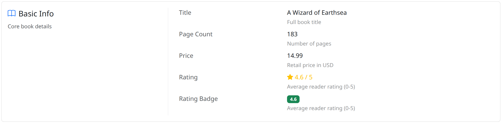
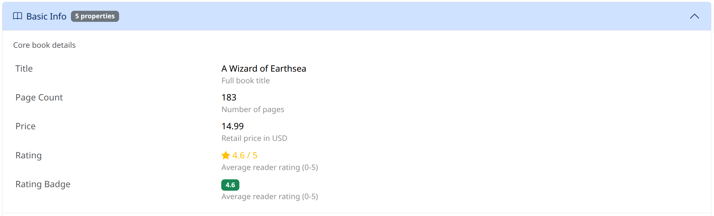
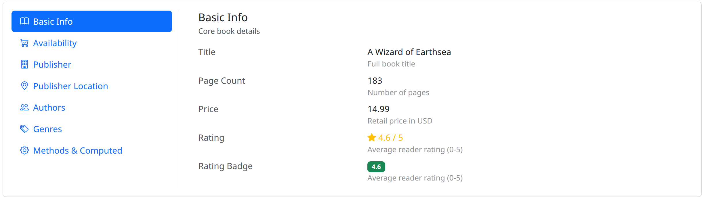
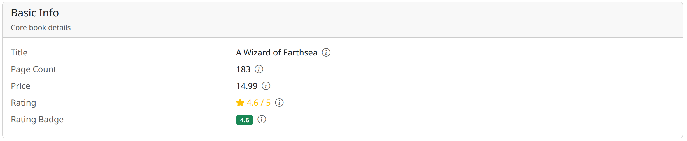
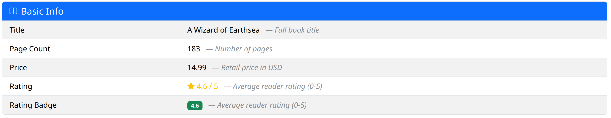
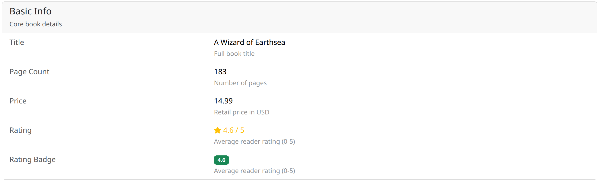
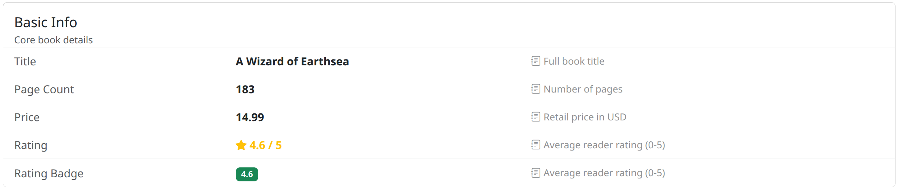

# Layout Packs

Seven layout packs are included:

| Pack | Setting value |
|------|---------------|
| Split card (default) | `"split-card"` |
| Accordion | `"accordion"` |
| Tabs (vertical) | `"tabs-vertical"` |
| Card rows | `"card-rows"` |
| Striped rows | `"striped-rows"` |
| Table inline | `"table-inline"` |
| List group (3-col) | `"list-group-3col"` |

Set the layout in your Django settings:

```python
CRUD_VIEWS_OBJECT_DETAIL_TEMPLATE_PACK_LAYOUT = "accordion"
```

## Screenshots

### Split Card (default)

Group title on the left, properties on the right inside a card.



### Accordion

Each group is a collapsible accordion panel.



### Tabs (vertical)

Groups as vertical tabs with properties in the tab content area.



### Card Rows

Each group rendered as a standalone card with stacked property rows. A property's
`detail` text is shown as a tooltip on an info icon (hover or keyboard focus). The
tooltip is initialised by the bundled `crud_views/js/tooltip.js` (via ``) and
needs Bootstrap's JavaScript; without it the text remains available to screen readers.



### Striped Rows

Alternating row backgrounds for easy scanning.



### Table Inline

Classic table layout with label and value columns.



### List Group (3-col)

Three-column list group with label, value, and detail.


